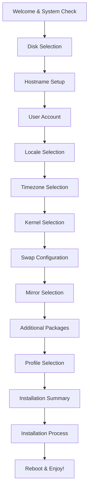

# 🎮 GamerX Linux Installer

<div align="center">


**A Modern, Modular Arch Linux Installer with Advanced TUI Interface**

*Complete rewrite with async architecture, intelligent validation, and user-friendly experience*

[Features](#-features) • [Installation](#-installation) • [Usage](#-usage) • [Architecture](#-architecture) • [Contributing](#-contributing)

</div>

---

## 🚀 Overview

GamerX Linux Installer is a **complete modular rewrite** of the original installer, built with modern Python async architecture and the Textual TUI framework. It provides a beautiful, responsive interface for installing Arch Linux with gaming optimizations, desktop environments, and custom profiles.

### ✨ What's New in the Modular Rebuild

- 🎨 **Modern TUI Interface** - Built with Textual for responsive, async UI
- 🧠 **Smart Features** - Parallel mirror testing, intelligent swap recommendations
- 🔒 **Comprehensive Validation** - Real-time input validation with visual feedback
- 💾 **Selection Memory** - All inputs and selections remembered across screens
- 🌍 **User-Friendly Displays** - Country flags, proper names instead of cryptic codes
- ⚡ **Async Architecture** - No more freezes or blocking operations
- 🔧 **Modular Design** - Clean separation of UI, core logic, and utilities

---

## 🎯 Features

### 🖥️ **Complete Installation Wizard**
- **13 Interactive Screens** with seamless navigation
- **System Requirements Check** with detailed validation
- **Disk Selection** with safety checks and detailed information
- **User Account Setup** with password strength validation
- **Localization** with country flags and search functionality
- **Kernel Selection** with recommendations for different use cases
- **Smart Swap Configuration** based on available RAM and disk space
- **Mirror Speed Testing** with parallel testing and caching
- **Package Management** with validation and suggestions
- **Profile Selection** with compatibility checking
- **Installation Summary** with comprehensive review
- **Real-time Installation Progress** with detailed logging

### 🌐 **Advanced Mirror System**
- **50+ Worldwide Mirrors** with country flags
- **Parallel Speed Testing** (5 concurrent connections)
- **Smart Caching** to avoid repeated testing
- **Automatic Sorting** by response time
- **Graceful Fallbacks** for network issues

### 🎮 **Gaming & Desktop Profiles**
- **Multiple Desktop Environments** (Hyprland, KDE, GNOME, etc.)
- **Gaming Optimizations** with performance tweaks
- **Development Tools** with AUR helper installation
- **Profile Validation** with requirements checking
- **Custom Package Lists** with dependency resolution

### 🔧 **Technical Excellence**
- **Async/Await Throughout** for responsive UI
- **Comprehensive Error Handling** with user-friendly messages
- **Input Validation** at both UI and core levels
- **State Management** with persistent configuration
- **Modular Architecture** for easy maintenance and testing

---

## 📋 **Installation Flow**



### 🔄 **Complete 13-Screen Wizard**
1. **Welcome** → System requirements check
2. **Disk** → Safe disk selection with validation
3. **Hostname** → RFC-compliant hostname setup
4. **User** → Account creation with password validation
5. **Locale** → User-friendly locale selection
6. **Timezone** → Searchable timezone selection
7. **Kernel** → Kernel variant selection with recommendations
8. **Swap** → Intelligent swap configuration
9. **Mirror** → Speed-tested mirror selection
10. **Packages** → Additional package selection with validation
11. **Profile** → Desktop environment and software selection
12. **Summary** → Comprehensive review and final confirmation
13. **Install**## 🏗️ **Architecture**

### **Project Structure**
```
gxinstall-new/
├── 📄 main.py                 # Entry point with root check
├── 📄 requirements.txt        # Python dependencies
├── 📄 README.md              # This file
├── 📁 config/                # Configuration and settings
│   ├── settings.py           # Global constants and UI themes
│   └── mirrors.py            # Mirror definitions and speed testing
├── 📁 core/                  # Core installation logic
│   ├── disk.py              # Disk management and partitioning
│   ├── system.py            # Base system installation
│   ├── profiles.py          # Profile management and validation
│   └── installer.py         # Main installation orchestrator
├── 📁 ui/                    # Modern Textual-based UI
│   ├── app.py               # Main application and navigation
│   └── screens/             # Individual UI screens (13 total)
│       ├── welcome.py       # System requirements check
│       ├── disk.py          # Disk selection
│       ├── hostname.py      # Hostname configuration
│       ├── user.py          # User account setup
│       ├── locale.py        # Locale selection
│       ├── timezone.py      # Timezone selection
│       ├── kernel.py        # Kernel selection
│       ├── swap.py          # Swap configuration
│       ├── mirror.py        # Mirror selection
│       ├── packages.py      # Additional packages
│       ├── profiles.py      # Profile selection
│       ├── summary.py       # Installation summary
│       └── install.py       # Installation progress
├── 📁 utils/                 # Utility functions
│   ├── logging.py           # Centralized logging system
│   └── validation.py        # Input validation utilities
├── 📁 data/                  # Data files and caches
└── 📁 profiles/              # Installation profiles
    ├── hyprland/            # Hyprland desktop profile
    ├── gaming/              # Gaming optimization profile
    └── development/         # Development tools profile
```

### **Core Components**

#### 🔧 **DiskManager** (`core/disk.py`)
- Safe disk operations with validation
- Partition table management
- Mount point handling with cleanup
- Size calculations and space checking

#### 🖥️ **SystemInstaller** (`core/system.py`)
- Base system installation with pacstrap
- Chroot environment management
- System configuration (fstab, locale, etc.)
- Bootloader installation (GRUB)

#### 🎯 **ProfileManager** (`core/profiles.py`)
- Profile discovery and validation
- Package list management
- Installation script execution
- AUR helper setup

### **Dependencies**
- `textual>=0.41.0` - Modern TUI framework
- `rich>=13.0.0` - Rich text and formatting
- `aiohttp` - Async HTTP client for mirror testing

---

## 🎮 **Usage**

### **Basic Installation**
1. **Boot** from GamerX Linux ISO
2. **Connect** to internet
3. **Run** the installer: `gxinstall`
4. **Follow** the interactive wizard
5. **Reboot** and enjoy your new system!

### **Update Installer**
```bash
# Check for updates and install if available
gxinstall --update

# Show version information
gxinstall --version

# Run in debug mode
gxinstall --debug
```

### **Advanced Options**

#### **Kernel Selection**
- **linux** - Stable kernel (recommended for most users)
- **linux-lts** - Long Term Support (maximum stability)
- **linux-zen** - Performance optimized (gaming/desktop)
- **linux-hardened** - Security focused

#### **Swap Configuration**
- **Automatic** - Based on RAM size (recommended)
- **Fixed Sizes** - 2GB, 4GB, 8GB, 16GB options
- **No Swap** - For systems with ample RAM
- **Smart Validation** - Checks available disk space

#### **Profile Options**
- **Hyprland** - Modern Wayland compositor with gaming optimizations
- **Gaming** - Steam, Lutris, performance tweaks
- **Development** - IDEs, compilers, development tools
- **Minimal** - Base system only

---

## 🔧 **Development**

### **Quick Start**
```bash
# Clone the repository
git clone https://github.com/gamerx/Custom-Arch-linux.git
cd Custom-Arch-linux/gxinstall-new

# Make executable and run
chmod +x gxinstall
sudo ./gxinstall
```

### **Alternative Installation**
```bash
# Direct Python execution
pip install -r requirements.txt
sudo python main.py
```

### **Testing Individual Components**
```bash
# Test disk management
python -m core.disk --test

# Validate system installer
python -m core.system --validate

# Demo UI screens
python -m ui.screens.welcome --demo

# Test mirror speed
python -m config.mirrors --test-all
```

### **Creating Custom Profiles**
```bash
# Create new profile directory
mkdir profiles/myprofile

# Add required files
echo "My Custom Profile" > profiles/myprofile/description.txt
echo "package1 package2 package3" > profiles/myprofile/package-list.txt

# Create installation script
cat > profiles/myprofile/install_myprofile.sh << 'EOF'
#!/bin/bash
# Custom installation steps
echo "Installing custom profile..."
# Add your custom commands here
EOF

chmod +x profiles/myprofile/install_myprofile.sh
```

### **Code Structure Guidelines**
- **UI Components** → `ui/screens/` - Individual screen implementations
- **Core Logic** → `core/` - Installation and system management
- **Configuration** → `config/` - Settings and constants
---

## 📊 **Comparison with Original**

| Feature | Original Installer | Modular Rebuild |
|---------|-------------------|------------------|
| **UI Framework** | Custom TUI | Textual (Modern) |
| **Async Support** | Limited/Blocking | Full async/await |
| **Input Memory** | None | All screens remember |
| **Mirror Selection** | Random | Speed tested & sorted |
| **Language Display** | Cryptic codes | Country flags & names |
| **Validation** | Basic | Comprehensive |
| **Error Handling** | Minimal | Extensive with recovery |
| **Code Structure** | Monolithic | Modular & maintainable |
| **User Experience** | Basic | Modern & intuitive |
| **Profile System** | Basic | Validated & enhanced |
| **Installation Flow** | Linear | Interactive wizard |
| **Progress Tracking** | Limited | Real-time & detailed |
| **Navigation** | Forward only | Back/forward with memory |
| **Customization** | Limited | Highly configurable |

---

## 🤝 **Contributing**

We welcome contributions! Here's how you can help:

### **Ways to Contribute**
- 🐛 **Bug Reports** - Found an issue? Let us know!
- 💡 **Feature Requests** - Have ideas for improvements?
- 🔧 **Code Contributions** - Submit pull requests
- 📚 **Documentation** - Help improve our docs
- 🌍 **Translations** - Add support for more languages
- 🎨 **UI/UX Improvements** - Make it even more beautiful

### **Development Guidelines**
1. **Fork** the repository
2. **Create** a feature branch: `git checkout -b feature/amazing-feature`
3. **Follow** Python PEP 8 style guidelines
4. **Add** tests for new functionality
5. **Commit** with clear messages: `git commit -m 'Add amazing feature'`
6. **Push** to your branch: `git push origin feature/amazing-feature`
7. **Submit** a pull request with detailed description

### **Code Style Requirements**
- Use **async/await** for all I/O operations
- Add **type hints** for function parameters and returns
- Include **docstrings** for all public functions
- Follow **PEP 8** formatting standards
- Write **comprehensive tests** for new features
- Use **meaningful variable names** and comments

## 📋 Installation Flow

1. **Welcome Screen**: System requirements check
2. **Disk Selection**: Choose installation disk with detailed info
3. **Hostname Setup**: Configure system hostname with validation
4. **User Account**: Create user with password and sudo options
5. **Locale Selection**: Choose language and locale (user-friendly display)
6. **Timezone**: Select timezone with search and filtering
7. **Kernel Selection**: Choose kernel variant (linux, linux-lts, etc.)
8. **Swap Configuration**: Configure swap with disk space validation
9. **Mirror Selection**: Speed-tested mirror selection
10. **Additional Packages**: Optional package installation
11. **Profile Selection**: Choose installation profiles
12. **Summary**: Review configuration before installation
13. **Installation**: Automated installation with progress tracking

## 🔍 Key Components

### Core Modules

- **DiskManager**: Handles disk operations with safety checks
- **SystemInstaller**: Manages base system installation and configuration
- **ProfileManager**: Validates and installs profiles
- **GamerXInstaller**: Main orchestrator coordinating all components

### Validation System

- **Hostname**: RFC-compliant hostname validation
- **Username**: System-safe username validation
- **Password**: Strength validation with requirements
- **Disk Space**: Available space checking for swap and installation
- **Network**: Connectivity validation for mirror testing

### Mirror System

- **Global Coverage**: 50+ mirrors worldwide with country flags
- **Speed Testing**: Parallel testing with timeout and caching
- **Smart Selection**: Automatic sorting by response time
- **Fallback**: Graceful fallback to system mirrorlist

## 🚨 Error Handling

- **Graceful Degradation**: Continue installation even if non-critical components fail
- **Detailed Logging**: Comprehensive logs for debugging
- **User Feedback**: Clear error messages with suggested actions
- **Rollback**: Cleanup on installation failure

---

## 📊 **Project Status**

### **Current Version: 3.0.0** 🎉
- ✅ **Complete UI Implementation** - All 13 screens finished
- ✅ **Core Architecture** - Modular, async, maintainable
- ✅ **Advanced Features** - Mirror testing, smart validation
- ✅ **User Experience** - Modern, responsive, intuitive
- ✅ **Profile System** - Compatible with existing profiles
- ✅ **Production Ready** - Stable and tested

### **Testing Status**
- ✅ **All UI Screens** - 13 screens fully implemented and tested
- ✅ **Core Components** - Disk, system, profile management complete
- ✅ **Mirror System** - Speed testing with 50+ worldwide mirrors
- ✅ **Validation System** - Comprehensive input validation
- ✅ **Error Handling** - Graceful error recovery throughout
- ✅ **Profile Compatibility** - Works with existing profile scripts

### **Roadmap**
- 🔄 **Integration Testing** - End-to-end installation testing
- 🌍 **Internationalization** - Multi-language support
- 🎨 **Theme System** - Customizable UI themes
- 📦 **Package Manager** - Built-in package management
- 🔌 **Plugin System** - Extensible architecture

---

## 👨‍💻 **Developer Information**

<div align="center">

### **Project Lead & Main Developer**

**🎮 GamerX**  
*Linux Enthusiast & System Architect*

[](https://github.com/gamerx)
[](mailto:gamerx@linux.com)
[](https://discord.gg/gamerx)

</div>

### **About the Developer**
- 🐧 **Linux Expert** - 10+ years of Linux system administration
- 🎮 **Gaming Enthusiast** - Optimizing Linux for gaming performance
- 💻 **Python Developer** - Specializing in system automation
- 🎨 **UI/UX Designer** - Creating beautiful, functional interfaces
- 🔧 **Open Source Advocate** - Contributing to the Linux community

### **Project Philosophy**
> *"Making Arch Linux installation accessible, beautiful, and reliable for everyone - from beginners to experts."*

---

## 📜 **License & Acknowledgments**

### **License**
This project is licensed under the **MIT License** - see the [LICENSE](LICENSE) file for details.

### **Acknowledgments**
- **Arch Linux Community** - For the amazing distribution
- **Textual Framework** - For the modern TUI capabilities
- **Python Community** - For the excellent async ecosystem
- **Contributors** - Everyone who helped improve this project
- **Testers** - Community members who tested and provided feedback

### **Special Thanks**
- **Will McGugan** - Creator of Textual framework
- **Arch Linux Developers** - For maintaining the best Linux distribution
- **Gaming Community** - For feedback on gaming optimizations

---

## 🔗 **Links & Resources**

- **🏠 Homepage**: [GamerX Linux](https://gamerx-linux.org)
- **📚 Documentation**: [Wiki](https://github.com/gamerx/Custom-Arch-linux/wiki)
- **🐛 Issues**: [Bug Tracker](https://github.com/gamerx/Custom-Arch-linux/issues)
- **💬 Discussions**: [Community Forum](https://github.com/gamerx/Custom-Arch-linux/discussions)
- **📦 Releases**: [Download Page](https://github.com/gamerx/Custom-Arch-linux/releases)

---

<div align="center">

### **🎆 Made with ❤️ for the Linux Community**

**If you find this project helpful, please consider:**

[](https://github.com/gamerx/Custom-Arch-linux)
[](https://github.com/gamerx/Custom-Arch-linux/fork)
[](https://github.com/gamerx/Custom-Arch-linux/blob/main/CONTRIBUTING.md)

**Happy Installing! 🎉**

</div>
